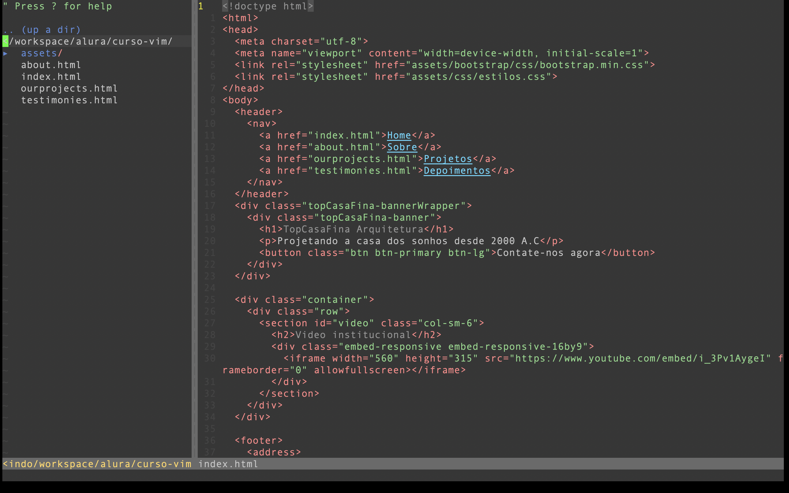
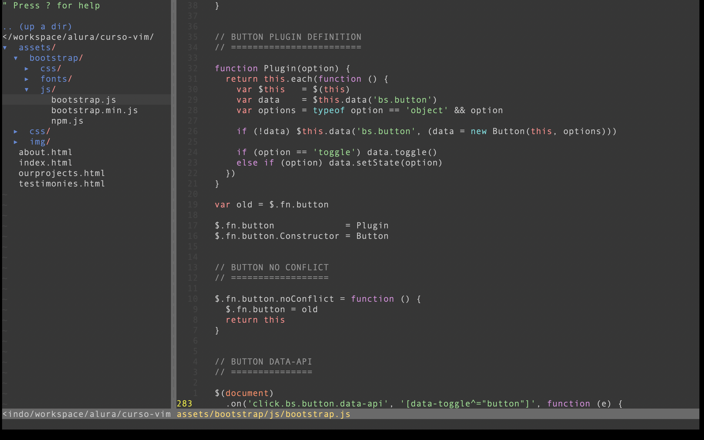

# VIM
Basic Vim Configuration with NerdTree Plugin

Based on [Alura Course: VIM](https://cursos.alura.com.br/course/vim)

## How to use it:
* Clone this repo: 
    * git clone --recurse-submodules https://github.com/helton-isac/VIM.git
* copy the .vimrc and .vim to your Home folder
* Done

## Samples:

## Commands:
* [Vim Cheat Sheet](https://vim.rtorr.com/)
* To open NERDTree use ":NERDTree"
* use ? for Help

